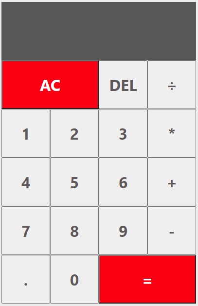

# JS Calculator

Making a calculator and functionality similar to the one on the iPhone.

This a short small web app to work on some JavaScript skills along with design in HTML and CSS

Technology Stack: JavaScript, HTML, CSS

## Installation

No installation necessary. Just clone repo and open index.html in a browser of your choice.
